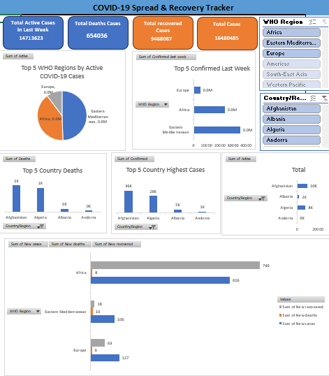

# 🦠 Covid-19 Spread & Recovery Tracker

## 📊 Real-Time Pandemic Data Analysis Dashboard


---

## 📌 Project Overview

The **Covid-19 Spread & Recovery Tracker** is a data analytics and visualization project designed to monitor the spread, recovery, and impact of COVID-19 using interactive dashboards and real-time insights.

This project helps analyze confirmed cases, recovery rates, death statistics, vaccination trends, and country-wise pandemic performance through visual analytics.

---

# 📸 Dashboard Preview



---

## 🚀 Features

* 📈 Global COVID-19 case tracking
* 🌍 Country-wise spread analysis
* 💉 Vaccination progress monitoring
* ❤️ Recovery and death rate insights
* 📅 Daily and monthly trend analysis
* 📊 Interactive charts and KPIs
* 🔍 Dynamic filtering options

---

## 🛠️ Tools & Technologies

| Tool                | Purpose               |
| ------------------- | --------------------- |
| Power BI            | Dashboard Development |
| SQL                 | Data Querying         |
| Python              | Data Analysis         |
| Excel               | Data Cleaning         |
| Pandas & Matplotlib | Visualization         |

---

## 📂 Dataset Information

The dataset includes:

* Confirmed Cases
* Active Cases
* Recovered Patients
* Death Statistics
* Vaccination Data
* Country & Region Information
* Daily Reports

---

## 📊 Key Insights

* Identified countries with highest infection rates
* Analyzed recovery and fatality trends
* Tracked vaccination growth worldwide
* Compared daily and monthly case increases
* Visualized pandemic spread patterns

---

## 📁 Project Structure

```bash
Covid-19-Spread-Recovery-Tracker/
│
├── data/
├── dashboard/
├── images/
├── sql/
└── README.md
```

---

## ⚡ Getting Started

```bash
git clone https://github.com/your-username/Covid-19-Spread-Recovery-Tracker.git
```

1. Open the dashboard file in Power BI
2. Load the dataset if required
3. Explore interactive reports and insights

---

## 🎯 Project Objective

The objective of this project is to provide meaningful insights into the COVID-19 pandemic using data visualization and analytics for better understanding and decision-making.

---

## 🤝 Contributing

Contributions are welcome.
Feel free to fork this repository and submit pull requests.

---

## 📧 Contact

**Your Name**
GitHub: https://github.com/your-username

---

## ⭐ Support

If you found this project useful, give it a ⭐ on GitHub.
